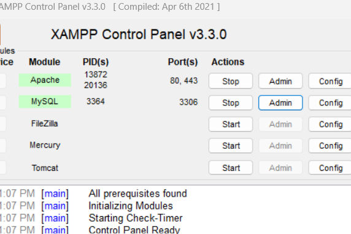

# Flask IoT Dashboard

Script is provided for the database (sorry for the mess that i have made in script i know you are smart and you can figure out)
If you want to know more about this project watch this video: - https://youtu.be/XqR6oifgDZI
////    lib
pip install scikit-learn==0.24.0 (python 3.9)
pip install scikit-learn==0.24.0 (python >=3.11)
pip install mysql-connector-python
////////////////
username : amansingh
pass : 123456

///////
step 1 : run xampp

step 2 : run arms.py
